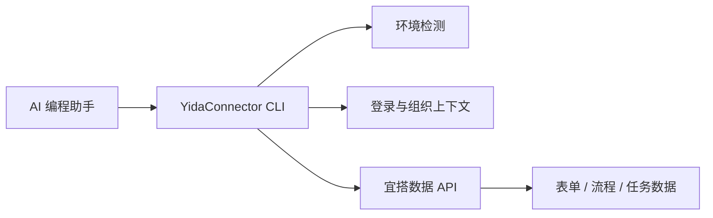

<div align="center">

# YidaConnector

**宜搭数据查询与登录态管理 CLI。**

YidaConnector 是一个命令行工具，用于查询宜搭表单、流程、任务数据并管理登录态。配合 AI 编程助手使用，实现用自然语言驱动宜搭数据操作。

[快速开始](#快速开始) · [data 命令详解](#data-命令详解) · [命令参考](#命令参考) · [贡献指南](./CONTRIBUTING.md) · [更新日志](./CHANGELOG.md)

[](https://www.npmjs.com/package/yidaconnector)
[](https://www.npmjs.com/package/yidaconnector)
[](https://github.com/bunnyrui/yidaconnector/actions/workflows/ci.yml)
[](./LICENSE)
[](https://nodejs.org)

**文档：** [GitHub README](https://github.com/bunnyrui/yidaconnector#readme)

</div>

---

## 快速开始

### 1. 安装

```bash
npm install -g yidaconnector
```

要求 Node.js 18 或更高版本。安装后提供 `yidaconnector` 和 `yida` 两个命令。

### 2. 检测环境

```bash
yidaconnector env
yidaconnector env --json
yidaconnector commands --json
```

`env` 会检测当前 AI 工具环境、工作区路径、登录态和组织信息。加 `--json` 输出机器可读格式，方便 AI 助手解析。`commands --json` 输出完整命令清单。

### 3. 登录

```bash
yidaconnector login
```

默认缓存优先；无缓存时自动尝试本地浏览器 CDP 登录，不可用则回退到二维码。如需指定入口（如阿里内网宜搭）：

```bash
yidaconnector login https://yida-group.alibaba-inc.com/
yidaconnector login --alibaba
```

更多登录方式见下方[登录与环境](#登录与环境)章节。

### 4. 查询数据

```bash
# 查询表单数据（分页）
yidaconnector data query form APP_XXX FORM_XXX --page 1 --size 20

# 查询全部表单数据（自动翻页）
yidaconnector data query form APP_XXX FORM_XXX --all

# 按条件查询
yidaconnector data query form APP_XXX FORM_XXX --search-json '[{"key":"radioField_xxx","op":"Equal","value":"合格"}]'

# 获取单条表单实例
yidaconnector data get form APP_XXX --inst-id FORM_INST_XXX

# 查询流程实例
yidaconnector data query process APP_XXX FORM_XXX --page 1 --size 10

# 查询待办任务
yidaconnector data query tasks APP_XXX --type todo
```

## 核心能力

| 领域 | 能做什么 |
|------|----------|
| **表单数据** | 查询 / 获取 / 新建 / 更新表单实例；查询子表单明细 |
| **流程数据** | 查询 / 获取 / 发起 / 更新流程实例；查询操作记录 |
| **任务操作** | 查询待办 / 已处理 / 我发起的 / 抄送任务；执行审批（同意/驳回） |
| **登录态** | 登录（CDP / 二维码 / 浏览器 handoff）、登出、刷新、状态查询 |
| **组织管理** | 列出和切换组织（多组织账号） |
| **环境管理** | 检测 AI 工具环境；管理公有云 / 私有化多环境配置 |

所有数据操作都遵循当前登录用户的宜搭数据权限——YidaConnector 不会绕过平台安全控制。

## data 命令详解

`yidaconnector data` 是所有数据操作的统一入口，语法为 `data <action> <resource> [参数] [选项]`。

### 表单操作

```bash
# 查询表单数据（分页 / 全量 / 按条件）
yidaconnector data query form <appType> <formUuid> [--page N] [--size N] [--all]
yidaconnector data query form <appType> <formUuid> --search-file .cache/yidaconnector/search.json

# 获取单条表单实例
yidaconnector data get form <appType> --inst-id <formInstId> [--form-uuid <formUuid>]

# 新建表单实例
yidaconnector data create form <appType> <formUuid> --data-file .cache/yidaconnector/data.json

# 更新表单实例
yidaconnector data update form <appType> --inst-id <formInstId> --data-file .cache/yidaconnector/data.json

# 查询子表单明细
yidaconnector data query subform <appType> <formUuid> --inst-id <formInstId> --table-field-id <fieldId>
```

### 流程操作

```bash
# 查询流程实例
yidaconnector data query process <appType> <formUuid> [--page N] [--size N]

# 获取单个流程实例
yidaconnector data get process <appType> --process-inst-id <processInstanceId>

# 发起流程
yidaconnector data create process <appType> <formUuid> --process-code <processCode> --data-file .cache/yidaconnector/data.json

# 更新流程表单数据
yidaconnector data update process <appType> --process-inst-id <processInstanceId> --data-file .cache/yidaconnector/data.json

# 查询操作记录
yidaconnector data query operation-records <appType> --process-inst-id <processInstanceId>
```

### 任务操作

```bash
# 查询任务列表（todo=待办 / done=已处理 / submitted=我发起的 / cc=抄送）
yidaconnector data query tasks <appType> --type <todo|done|submitted|cc> [--keyword <text>] [--page N] [--size N]

# 执行审批任务（同意/驳回）
yidaconnector data execute task <appType> \
  --task-id <taskId> \
  --process-inst-id <processInstanceId> \
  --out-result <AGREE|DISAGREE> \
  --remark "审批意见"
```

### 注意事项

- **组件别名**：加 `--resolve-aliases` 可在 `--data-json` / `--search-json` 中使用字段别名（如 `phone`）代替原始 fieldId（如 `textField_xxx`）。
- **日期字段**：宜搭日期字段要求 13 位毫秒时间戳（如 `1719705600000`），不能传 `YYYY-MM-DD` 字符串。
- **分页**：每页最大 100 条；`--all` 自动翻页；`--max-pages` 限制最大拉取页数。
- **临时文件**：查询结果、查询条件 JSON、导入数据等建议写入 `.cache/yidaconnector/`，保持仓库根目录整洁。

## 登录与环境

### 登录模式

| 命令 | 行为 |
|---------|------|
| `yidaconnector login` | 缓存优先；回退到 CDP，再到二维码 handoff |
| `yidaconnector login --browser` | 强制本地浏览器（CDP，Playwright 兜底） |
| `yidaconnector login --qr` | 强制终端二维码 |
| `yidaconnector login --agent-qr` | 强制 AI 对话框二维码 handoff |
| `yidaconnector login --codex` / `--qoder` / `--wukong` | 指定工具的浏览器 handoff |
| `yidaconnector login --check-only` | 只读检查登录态，不触发登录 |
| `yidaconnector login <url>` | 登录到指定宜搭入口 URL |

### 环境管理

```bash
# 查看当前环境（AI 工具、登录态、base URL）
yidaconnector env
yidaconnector env --json

# 多环境管理（公有云 / 国际版 / 阿里内部 / 私有化）
yidaconnector env list
yidaconnector env switch <name>
yidaconnector env add <name>
```

### 组织切换

```bash
yidaconnector org list
yidaconnector org switch --corp-id <corpId>
```

## 工作原理



YidaConnector 将平台相关的逻辑封装在 CLI 内部，AI 助手只需通过稳定的命令和 JSON 输入输出与之交互。

## 项目结构

```text
yidaconnector/
├── bin/yida.js                 # CLI 入口与命令路由
├── lib/
│   ├── app/                    # 表单 Schema 辅助（get-schema、form-navigation）
│   ├── auth/                   # 登录（CDP / 二维码 / Codex）、登录态管理、组织切换
│   └── core/                   # 环境检测、国际化、数据命令、HTTP 客户端
├── project/                    # 演示页面与 PRD 模板
├── yida-skills/                # AI 技能包源码与宜搭 API 参考文档
└── scripts/                    # CI、打包与安装辅助脚本
```

## 命令参考

运行 `yidaconnector --help` 或 `yidaconnector <命令> --help` 查看详细用法。

<!-- YIDACONNECTOR_COMMANDS_START -->
<!-- This section is generated by `npm run docs:commands`. Do not edit command rows by hand. -->

### Auth & Environment

| Command | Description |
|---------|-------------|
| `yidaconnector login [target-url] [--qr\|--agent-qr\|--codex\|--browser] [--env <name>\|--intl\|--overseas\|--global\|--yidaapps\|--alibaba] [--corp-id <corpId>]` | Login (cache first, --browser or --agent-qr when needed) |
| `yidaconnector logout` | Logout / switch account |
| `yidaconnector auth <status\|login\|refresh\|logout>` | Login state management |
| `yidaconnector org <list\|switch>` | Organization management (list / switch) |
| `yidaconnector env [--json]` | Detect AI tool environment & login state |
| `yidaconnector env <setup\|list\|show\|switch\|add\|remove>` | Manage public/private Yida environment profiles |

### Data & Permissions

| Command | Description |
|---------|-------------|
| `yidaconnector data <action> <resource> [args]` | Unified data management (form/process/task/subform) |

### Utility

| Command | Description |
|---------|-------------|
| `yidaconnector commands [--json]` | Output machine-readable command manifest |

<!-- YIDACONNECTOR_COMMANDS_END -->

### 环境与本地化

登录时可用 `--env intl`、`--intl`、`--overseas`、`--global`、`--yidaapps` 等环境选择 flag 指定目标宜搭环境。`intl` 预设使用 `https://www.yidaapps.com` 作为国际版宜搭入口，通过 `https://login.dingtalk.io` 完成钉钉国际版 OAuth。

### 组件别名

宜搭表单字段可配置别名（如 `phone` 代替 `textField_xxx`）。在 `data` 命令中加 `--resolve-aliases`，即可在 `--data-json` / `--search-json` 中使用别名；YidaConnector 会在发请求前自动翻译为 fieldId。

## AI 技能包

`yida-skills/` 是技能包源码目录。悟空发布包由 `npm run build:skills` 生成：展开目录写入 `dist/skills/yidaconnector/`，上传用 zip 写入 `yidaconnector-skills.zip`。

| 技能 | 用途 |
|------|------|
| `yida-data-management` | 表单 / 子表单 / 流程 / 任务数据查询与变更 |
| `yida-login` | 登录态管理（通常自动触发） |
| `yida-logout` | 登出 / 切换账号 |
| `large-file-write` | 大文件可靠写入辅助 |

悟空手动导入：上传生成的 `yidaconnector-skills.zip`。Codex 安装：`npm install -g yidaconnector` 后会在 `~/.yidaconnector/codex-plugin` 创建本地插件市场。

## 悟空安装

悟空通过手动上传技能包安装，不走 npm：

1. 从 [GitHub Releases](https://github.com/bunnyrui/yidaconnector/releases) 下载最新的 `.zip` 技能包。
2. 打开悟空。
3. 进入 **技能中心** > **上传技能**，选择下载的包。

在悟空终端中执行 `node` / `npm` / `npx` 前，务必先将其自带 Node.js 加入 PATH：

```bash
export PATH="$HOME/.real/.bin/node/bin:$PATH"
```

## 支持的 AI 编程工具

| 工具 | 支持状态 |
|------|---------|
| [Codex](https://openai.com/codex/) | 完整支持 |
| [Claude Code](https://claude.ai/code) | 完整支持 |
| [Aone Copilot](https://copilot.code.alibaba-inc.com) | 完整支持 |
| [OpenCode](https://opencode.ai) | 完整支持 |
| [Cursor](https://cursor.com/) | 完整支持 |
| [Visual Studio Code](https://code.visualstudio.com/) | 完整支持 |
| [QoderWork](https://qoder.com) | 完整支持 |
| [Qoder](https://qoder.com) | 完整支持 |
| [Wukong](https://dingtalk.com/wukong) | 完整支持 |

## 开发

```bash
git clone https://github.com/bunnyrui/yidaconnector.git
cd yidaconnector
npm install
npm run check:ci
```

常用校验命令：

| 命令 | 用途 |
|---------|---------|
| `npm test` | 运行 Jest 测试 |
| `npm run lint` | 运行 ESLint |
| `npm run check:quick` | 结构、manifest、语法、lint 快检 |
| `npm run check:commands` | 校验路由、命令清单与 README 一致性 |
| `npm run docs:commands` | 从 manifest 重新生成 README 命令索引 |
| `npm run check:docs` | 确认 README 命令文档是最新的 |
| `npm run check:syntax` | JavaScript 语法校验 |
| `npm run check:skills` | 技能包结构与链接校验 |

新增 CLI 命令时，需在 `bin/yida.js` 注册路由、在 `lib/core/command-manifest.js` 添加元数据、用 `npm run docs:commands` 重新生成 README 命令索引，并同步 `yida-skills/` 技能文档。三者不一致时 `npm run check:commands` 会报错。

## 安全与配置

- 登录 Cookie 缓存在本地，绝不要硬编码到源码中。
- 私有化部署环境通过 `lib/core/env-manager.js` 管理。
- 宜搭 API 请求使用当前环境的 base URL 和已认证的 Cookie。
- 多组织账号在非交互式自动化场景中建议显式传 `--corp-id`。

## 贡献者

感谢所有为 YidaConnector 贡献过代码的人。阅读[贡献指南](./CONTRIBUTING.md)参与项目。

最新贡献者：[DDlixin1](https://github.com/DDlixin1)、[fcloud](https://github.com/fcloud)。

<!-- yidaconnector-contributors:start -->

<p>
  <a href="https://github.com/yize"></a>
  <a href="https://github.com/alex-mm"></a>
  <a href="https://github.com/DDlixin1"></a>
  <a href="https://github.com/fcloud"></a>
  <a href="https://github.com/nicky1108"></a>
  <a href="https://github.com/angelinheys"></a>
  <a href="https://github.com/yipengmu"></a>
  <a href="https://github.com/Waawww"></a>
  <a href="https://github.com/kangjiano"></a>
  <a href="https://github.com/ElZe98"></a>
  <a href="https://github.com/OAHyuhao"></a>
  <a href="https://github.com/xiaofu704"></a>
  <a href="https://github.com/guchenglin111"></a>
  <a href="https://github.com/liug0911"></a>
  <a href="https://github.com/sunliz-xiuli"></a>
  <a href="https://github.com/M12REDX"></a>
  <a href="https://github.com/key-668"></a>
  <a href="https://github.com/dongbeixiaohuo"></a>
  <a href="https://github.com/nandanadileep"></a>
</p>

<!-- yidaconnector-contributors:end -->

## License

[MIT](./LICENSE) © 2026 bunnyruihan
