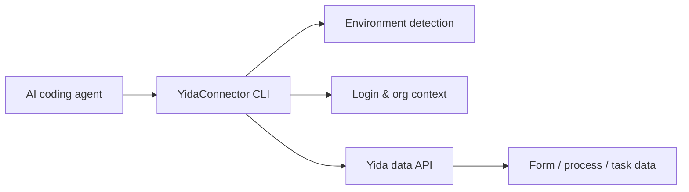

<div align="center">


# YidaConnector

**宜搭数据查询与登录态管理 CLI。**

YidaConnector 让 AI 编程助手（悟空 / Claude Code / Codex / Cursor / OpenCode 等）和宜搭低代码平台对接，专注于表单、流程、任务、子表单数据的查询与变更，以及登录态、多组织、多环境的管理。

[Quick Start](#quick-start) · [Data Command](#data-command) · [CLI Reference](#cli-reference) · [Contributing](./CONTRIBUTING.md) · [Changelog](./CHANGELOG.md)

[](https://www.npmjs.com/package/yidaconnector)
[](https://www.npmjs.com/package/yidaconnector)
[](https://github.com/bunnyrui/yidaconnector/actions/workflows/ci.yml)
[](./LICENSE)
[](https://nodejs.org)

**Documentation:** [GitHub README](https://github.com/bunnyrui/yidaconnector#readme)

</div>

---

## Quick Start

### 1. Install

```bash
npm install -g yidaconnector
```

YidaConnector requires Node.js 18 or later. The package exposes both `yidaconnector` and `yida` commands.

### 2. Check Your Environment

Run this from the AI coding workspace where you want YidaConnector to operate:

```bash
yidaconnector env
yidaconnector env --json
yidaconnector commands --json
```

YidaConnector detects the active agent environment, workspace path, login state, and organization context. Use `--json` when an agent needs a stable machine-readable snapshot.
`yidaconnector commands --json` emits the command manifest used by the CLI help, so agents can inspect available routes without scraping terminal output.

### 3. Log In

```bash
yidaconnector login
```

In Codex, QoderWork, Qoder, Wukong, Claude Code, OpenCode, Cursor, and other detected AI tools, YidaConnector first tries local Chrome/Edge/Chromium CDP when no valid cached login exists. If local CDP is unavailable, it falls back to an AI-dialog QR handoff. The explicit `yidaconnector login --browser` command still prefers CDP first and uses Playwright as an optional browser fallback.

When the user names a target Yida entry URL, pass it to the login command so YidaConnector can select the matching environment and cookie file. For example, Alibaba intranet Yida:

```bash
yidaconnector login https://yida-group.alibaba-inc.com/
yidaconnector login --alibaba
```

For terminal QR login, use:

```bash
yidaconnector login --qr
```

### 4. Query Data

```bash
# 查询表单数据（分页）
yidaconnector data query form APP_XXX FORM_XXX --page 1 --size 20

# 查询全部表单数据（自动翻页）
yidaconnector data query form APP_XXX FORM_XXX --all

# 按条件查询
yidaconnector data query form APP_XXX FORM_XXX --search-json '[{"key":"radioField_xxx","op":"Equal","value":"合格"}]'

# 获取单条表单实例
yidaconnector data get form APP_XXX --inst-id FORM_INST_XXX

# 查询流程实例
yidaconnector data query process APP_XXX FORM_XXX --page 1 --size 10

# 查询待办任务
yidaconnector data query tasks APP_XXX --type todo
```

## What YidaConnector Does

| Area | What you can do |
|------|-----------------|
| **Form data** | Query / get / create / update form instances; query subform rows |
| **Process data** | Query / get / create / update process instances; query operation records |
| **Task operations** | Query todo / done / submitted / cc tasks; execute (approve/reject) tasks |
| **Login state** | Login (CDP / QR / browser handoff), logout, refresh, status check |
| **Organization** | List and switch organizations (multi-org accounts) |
| **Environment** | Detect AI tool environment; manage public / private deployment profiles |

All data operations respect the current Yida login user's data permissions — YidaConnector never bypasses platform security controls.

## Data Command

`yidaconnector data` is the unified entry point for all data operations. The syntax is `data <action> <resource> [args] [options]`.

### Form Operations

```bash
# 查询表单数据（分页 / 全量 / 按条件）
yidaconnector data query form <appType> <formUuid> [--page N] [--size N] [--all]
yidaconnector data query form <appType> <formUuid> --search-file .cache/yidaconnector/search.json

# 获取单条表单实例
yidaconnector data get form <appType> --inst-id <formInstId> [--form-uuid <formUuid>]

# 新建表单实例
yidaconnector data create form <appType> <formUuid> --data-file .cache/yidaconnector/data.json

# 更新表单实例
yidaconnector data update form <appType> --inst-id <formInstId> --data-file .cache/yidaconnector/data.json

# 查询子表单明细
yidaconnector data query subform <appType> <formUuid> --inst-id <formInstId> --table-field-id <fieldId>
```

### Process Operations

```bash
# 查询流程实例
yidaconnector data query process <appType> <formUuid> [--page N] [--size N]

# 获取单个流程实例
yidaconnector data get process <appType> --process-inst-id <processInstanceId>

# 发起流程
yidaconnector data create process <appType> <formUuid> --process-code <processCode> --data-file .cache/yidaconnector/data.json

# 更新流程表单数据
yidaconnector data update process <appType> --process-inst-id <processInstanceId> --data-file .cache/yidaconnector/data.json

# 查询操作记录
yidaconnector data query operation-records <appType> --process-inst-id <processInstanceId>
```

### Task Operations

```bash
# 查询任务列表（todo=待办 / done=已处理 / submitted=我发起的 / cc=抄送）
yidaconnector data query tasks <appType> --type <todo|done|submitted|cc> [--keyword <text>] [--page N] [--size N]

# 执行审批任务（同意/驳回）
yidaconnector data execute task <appType> \
  --task-id <taskId> \
  --process-inst-id <processInstanceId> \
  --out-result <AGREE|DISAGREE> \
  --remark "审批意见"
```

### Data Command Notes

- **Component aliases**: Add `--resolve-aliases` to use field aliases (like `phone`) instead of raw field IDs (like `textField_xxx`) in `--data-json` / `--search-json`.
- **Date fields**: Yida date fields require 13-digit millisecond timestamps (e.g. `1719705600000`), not `YYYY-MM-DD` strings.
- **Page size**: Max 100 per page; `--all` auto-paginates; `--max-pages` caps the total pages fetched.
- **Temporary files**: Write query results, search JSON, and import data to `.cache/yidaconnector/` to keep the repository root clean.

## Login & Environment

### Login Modes

| Command | Behavior |
|---------|----------|
| `yidaconnector login` | Cache first; falls back to CDP, then QR handoff |
| `yidaconnector login --browser` | Force local browser (CDP, Playwright fallback) |
| `yidaconnector login --qr` | Force terminal QR code |
| `yidaconnector login --agent-qr` | Force AI-dialog QR handoff |
| `yidaconnector login --codex` / `--qoder` / `--wukong` | Tool-specific browser handoff |
| `yidaconnector login --check-only` | Read-only login state check, no login triggered |
| `yidaconnector login <url>` | Login to a specific Yida entry URL |

### Environment Management

```bash
# 查看当前环境（AI 工具、登录态、base URL）
yidaconnector env
yidaconnector env --json

# 多环境管理（公有云 / 国际版 / 阿里内部 / 私有化）
yidaconnector env list
yidaconnector env switch <name>
yidaconnector env add <name>
```

### Organization Switching

```bash
yidaconnector org list
yidaconnector org switch --corp-id <corpId>
```

## How It Works



YidaConnector keeps platform-specific behavior inside the CLI, while agents interact with predictable commands and project files.

## Project Layout

```text
yidaconnector/
├── bin/yida.js                 # CLI entry and command routing
├── lib/
│   ├── app/                    # Form schema helpers (get-schema, form-navigation)
│   ├── auth/                   # Login (CDP / QR / Codex), auth state, org switch
│   └── core/                   # Environment detection, i18n, data commands, HTTP client
├── project/                    # Default workspace template
├── yida-skills/                # Source skill docs and Yida API references
└── scripts/                    # CI, packaging, and installation helpers
```

## CLI Reference

Run `yidaconnector --help` or `yidaconnector <command> --help` for detailed usage.

<!-- YIDACONNECTOR_COMMANDS_START -->
<!-- This section is generated by `npm run docs:commands`. Do not edit command rows by hand. -->

### Auth & Environment

| Command | Description |
|---------|-------------|
| `yidaconnector login [target-url] [--qr\|--agent-qr\|--codex\|--browser] [--env <name>\|--intl\|--overseas\|--global\|--yidaapps\|--alibaba] [--corp-id <corpId>]` | Login (cache first, --browser or --agent-qr when needed) |
| `yidaconnector logout` | Logout / switch account |
| `yidaconnector auth <status\|login\|refresh\|logout>` | Login state management |
| `yidaconnector org <list\|switch>` | Organization management (list / switch) |
| `yidaconnector env [--json]` | Detect AI tool environment & login state |
| `yidaconnector env <setup\|list\|show\|switch\|add\|remove>` | Manage public/private Yida environment profiles |

### Data & Permissions

| Command | Description |
|---------|-------------|
| `yidaconnector data <action> <resource> [args]` | Unified data management (form/process/task/subform) |

### Utility

| Command | Description |
|---------|-------------|
| `yidaconnector commands [--json]` | Output machine-readable command manifest |

<!-- YIDACONNECTOR_COMMANDS_END -->

### CLI Notes

#### Environment and Localization

Environment selectors such as `--env intl`, `--intl`, `--overseas`, `--global`, and `--yidaapps` can be used on login to choose the target Yida environment for that run. The `intl` preset uses `https://www.yidaapps.com` as the built-in Global YiDA entrypoint and DingTalk International OAuth at `https://login.dingtalk.io`.

#### Component Aliases

Yida form fields can have aliases (e.g. `phone` instead of `textField_xxx`). Use `yidaconnector data ... --resolve-aliases` to accept aliases in `--data-json` / `--search-json` inputs; YidaConnector translates them to field IDs before sending requests.

## Agent Skills

The `yida-skills/` directory is the source skill library. Release assets for Wukong are generated by `npm run build:skills`: the expanded package is written to `dist/skills/yidaconnector/`, and the upload-ready zip is written to `yidaconnector-skills.zip`.

| Skill | Purpose |
|------|---------|
| `yida-data-management` | Form / subform / process / task data query and mutation |
| `yida-login` | Login state management (usually auto-triggered) |
| `yida-logout` | Logout / switch account |
| `large-file-write` | Reliable large file write helper |

For Wukong manual import, upload the generated `yidaconnector-skills.zip`. For Codex, `npm install -g yidaconnector` additionally creates a local plugin marketplace under `~/.yidaconnector/codex-plugin`.

## Wukong Installation

Wukong uses manual skill package installation instead of npm:

1. Download the latest `.zip` skill package from [GitHub Releases](https://github.com/bunnyrui/yidaconnector/releases).
2. Open Wukong.
3. Go to **Skill Center** > **Upload Skill** and select the downloaded package.

For Wukong terminal work, make sure its bundled Node.js path is active before running `node`, `npm`, or `npx` commands:

```bash
export PATH="$HOME/.real/.bin/node/bin:$PATH"
```

## Supported AI Coding Tools

| Tool | Support |
|------|---------|
| [Codex](https://openai.com/codex/) | Full support |
| [Claude Code](https://claude.ai/code) | Full support |
| [Aone Copilot](https://copilot.code.alibaba-inc.com) | Full support |
| [OpenCode](https://opencode.ai) | Full support |
| [Cursor](https://cursor.com/) | Full support |
| [Visual Studio Code](https://code.visualstudio.com/) | Full support |
| [QoderWork](https://qoder.com) | Full support |
| [Qoder](https://qoder.com) | Full support |
| [Wukong](https://dingtalk.com/wukong) | Full support |

## Development

```bash
git clone https://github.com/bunnyrui/yidaconnector.git
cd yidaconnector
npm install
npm run check:ci
```

Useful checks:

| Command | Purpose |
|---------|---------|
| `npm test` | Run Jest tests |
| `npm run lint` | Run ESLint |
| `npm run check:quick` | Run structure, manifest, syntax, and lint checks |
| `npm run check:commands` | Validate router, command manifest, and README alignment |
| `npm run docs:commands` | Regenerate the README command index from the manifest |
| `npm run check:docs` | Verify generated README command docs are current |
| `npm run check:syntax` | Validate JavaScript syntax |
| `npm run check:skills` | Validate agent skills structure and links |

When adding new CLI commands, register the route in `bin/yida.js`, add it to `lib/core/command-manifest.js`, regenerate the README command index with `npm run docs:commands`, and keep agent skills in `yida-skills/` aligned. `npm run check:commands` fails if the router, manifest, or README drift apart.

## Security and Configuration

- Login cookies are cached locally and should never be hard-coded into source files.
- Private deployment environments are managed through `lib/core/env-manager.js`.
- Yida API requests use the active environment base URL and authenticated cookies.
- For multi-organization accounts, prefer explicit `--corp-id` values in non-interactive automation.

## Community

Scan the QR code to join the YidaConnector DingTalk user group for updates and support.


## Contributors

Thanks to everyone who has contributed to YidaConnector. Read the [Contributing Guide](./CONTRIBUTING.md) to get involved.

Latest contributors: [DDlixin1](https://github.com/DDlixin1), [fcloud](https://github.com/fcloud).

<!-- yidaconnector-contributors:start -->

<p>
  <a href="https://github.com/yize"></a>
  <a href="https://github.com/alex-mm"></a>
  <a href="https://github.com/DDlixin1"></a>
  <a href="https://github.com/fcloud"></a>
  <a href="https://github.com/nicky1108"></a>
  <a href="https://github.com/angelinheys"></a>
  <a href="https://github.com/yipengmu"></a>
  <a href="https://github.com/Waawww"></a>
  <a href="https://github.com/kangjiano"></a>
  <a href="https://github.com/ElZe98"></a>
  <a href="https://github.com/OAHyuhao"></a>
  <a href="https://github.com/xiaofu704"></a>
  <a href="https://github.com/guchenglin111"></a>
  <a href="https://github.com/liug0911"></a>
  <a href="https://github.com/sunliz-xiuli"></a>
  <a href="https://github.com/M12REDX"></a>
  <a href="https://github.com/key-668"></a>
  <a href="https://github.com/dongbeixiaohuo"></a>
  <a href="https://github.com/nandanadileep"></a>
</p>

<!-- yidaconnector-contributors:end -->

## License

[MIT](./LICENSE) © 2026 Alibaba Group Holding Limited
