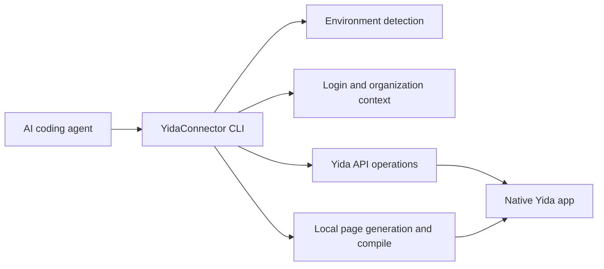

<div align="center">


# YidaConnector

**AI-native CLI for building DingTalk Yida low-code applications.**

YidaConnector connects AI coding agents with Yida's low-code platform, so developers can create apps, forms, workflows, custom pages, reports, integrations, and deployment configuration from a normal chat-driven development workflow.

[Quick Start](#quick-start) · [Capabilities](#capabilities) · [CLI Reference](#cli-reference) · [Examples](#examples) · [Contributing](./CONTRIBUTING.md) · [Changelog](./CHANGELOG.md)

[](https://www.npmjs.com/package/yidaconnector)
[](https://www.npmjs.com/package/yidaconnector)
[](https://github.com/bunnyrui/yidaconnector/actions/workflows/ci.yml)
[](./LICENSE)
[](https://nodejs.org)

**Documentation:** [GitHub README](https://github.com/bunnyrui/yidaconnector#readme)

</div>

---

## What YidaConnector Provides

YidaConnector is a bridge between AI coding tools and Yida. It gives agents a stable command-line interface for the full application lifecycle:

| Area | What you can do |
|------|-----------------|
| Application delivery | Create, update, export, and import Yida applications |
| Form modeling | Create forms, update fields, inspect schemas, and manage permissions |
| Custom pages | Generate React-based pages, lint Yida runtime rules, compile, and publish |
| Workflow automation | Create process forms, configure approval flows, preview process instances |
| Data operations | Query form/process/task/subform data and run anomaly checks |
| Integrations | Manage HTTP connectors, connector actions, auth accounts, and automation flows |
| Operations | Diagnose environment issues, manage login state, configure sharing, upload CDN assets |

The result remains a native Yida application: teams can continue editing it in Yida, use existing enterprise security controls, and deploy through the Yida platform.

## Quick Start

### 1. Install

```bash
npm install -g yidaconnector
```

YidaConnector requires Node.js 18 or later. The package exposes both `yidaconnector` and `yida` commands.

If Codex is already installed, YidaConnector also imports a local Codex plugin during postinstall. Restart Codex after installation, then type `@宜搭` or `@yidaconnector` in the composer to attach the YidaConnector context.

### 2. Check Your Environment

Run this from the AI coding workspace where you want YidaConnector to operate:

```bash
yidaconnector env
yidaconnector env --json
yidaconnector commands --json
```

YidaConnector detects the active agent environment, workspace path, login state, and organization context. Use `--json` when an agent needs a stable machine-readable snapshot.
`yidaconnector commands --json` emits the command manifest used by the CLI help, so agents can inspect available routes without scraping terminal output.

### 3. Log In

```bash
yidaconnector login
```

In Codex, QoderWork, Qoder, Wukong, Claude Code, OpenCode, Cursor, and other detected AI tools, YidaConnector first tries local Chrome/Edge/Chromium CDP when no valid cached login exists. If local CDP is unavailable, it falls back to an AI-dialog QR handoff. The agent should render `qr_image_markdown` or paste `agent_response_markdown` directly in the conversation so the QR code is visible, then run `poll_command` after the user scans it with DingTalk. If image rendering is unavailable, fall back to `qr_url`. The explicit `yidaconnector login --browser` command still prefers CDP first and uses Playwright as an optional browser fallback.

When the user names a target Yida entry URL, pass it to the login command so YidaConnector can select the matching environment and cookie file. For example, Alibaba intranet Yida uses `cookies-alibaba.json`:

```bash
yidaconnector login https://yida-group.alibaba-inc.com/
yidaconnector login --alibaba
```

The explicit QR polling command remains available:

```bash
yidaconnector login --agent-qr
```

For terminal QR login, use:

```bash
yidaconnector login --qr
yidaconnector login --qr --corp-id dingxxxxxxxx
yidaconnector login --check-only --json
```

YidaConnector does not install Playwright by default.

### 4. Build With an AI Agent

Ask your coding agent for a concrete Yida application or workflow:

```text
Create a CRM application in Yida with customer, contact, opportunity, and follow-up forms.
Build an IPD workflow for chip production, including approval nodes and dashboard pages.
Generate a public landing page and publish it to my Yida app.
```

The agent can then call YidaConnector commands to create the application, generate source files, publish pages, and return the final Yida URLs. In Codex, QoderWork, Qoder, and Wukong environments, successful creation and publish commands also include a browser handoff so the agent can open the resulting Yida page in the in-app browser. Use `--open` to force this handoff or `--no-open` to suppress it.

## Wukong Installation

Wukong uses manual skill package installation instead of npm:

1. Download the latest `.zip` skill package from [GitHub Releases](https://github.com/bunnyrui/yidaconnector/releases).
2. Open Wukong.
3. Go to **Skill Center** > **Upload Skill** and select the downloaded package.

For Wukong terminal work, make sure its bundled Node.js path is active before running `node`, `npm`, or `npx` commands:

```bash
export PATH="$HOME/.real/.bin/node/bin:$PATH"
```

## Supported AI Coding Tools

| Tool | Support |
|------|---------|
| [Codex](https://openai.com/codex/) | Full support |
| [Claude Code](https://claude.ai/code) | Full support |
| [Aone Copilot](https://copilot.code.alibaba-inc.com) | Full support |
| [OpenCode](https://opencode.ai) | Full support |
| [Cursor](https://cursor.com/) | Full support |
| [Visual Studio Code](https://code.visualstudio.com/) | Full support |
| [QoderWork](https://qoder.com) | Full support |
| [Qoder](https://qoder.com) | Full support |
| [Wukong](https://dingtalk.com/wukong) | Full support |

## How It Works



YidaConnector keeps platform-specific behavior inside the CLI, while agents interact with predictable commands and project files.

## Project Layout

```text
yidaconnector/
├── bin/yida.js                 # CLI entry and command routing
├── lib/
│   ├── app/                    # Application, form, page, import/export commands
│   ├── auth/                   # Login, QR login, browser handoff, organization switch
│   ├── connector/              # HTTP connector lifecycle and smart creation
│   ├── core/                   # Environment detection, i18n, diagnostics, data commands
│   ├── process/                # Process form creation, configuration, preview
│   ├── report/                 # Yida report and chart generation
│   └── samples/                # Templates emitted by yidaconnector sample
├── project/                    # Default workspace template for generated Yida projects
├── yida-skills/                # Source skill docs and Yida API references
└── scripts/                    # CI, packaging, and installation helpers
```

## Capabilities

### Application and Form Management

```bash
yidaconnector create-app "CRM"
yidaconnector create-app --name "CRM" --desc "Customer management" --theme deepBlue
yidaconnector app-list --size 20
yidaconnector corp-efficiency
yidaconnector create-form create APP_XXX "Customer" .cache/yidaconnector/forms/customer-fields.json
yidaconnector create-form update APP_XXX FORM_XXX .cache/yidaconnector/forms/customer-changes.json
yidaconnector get-schema APP_XXX FORM_XXX
yidaconnector get-schema APP_XXX --all --output-dir .cache/schemas
```

### Custom Page Development

```bash
yidaconnector create-page APP_XXX "Dashboard" --mode dashboard
yidaconnector generate-page product-homepage --spec .cache/yidaconnector/page-specs/home.json --output pages/src/home.oyd.jsx --compile
yidaconnector generate-page todo-mvc --output pages/src/todo-mvc.oyd.jsx --compile
yidaconnector check-page pages/src/home.oyd.jsx
yidaconnector compile pages/src/home.oyd.jsx
yidaconnector publish pages/src/home.oyd.jsx APP_XXX FORM_XXX
```

`generate-page` turns a structured spec into a Page IR, renders a curated React 16-compatible template, writes a `.yidaconnector-page.json` manifest, and optionally compiles the result. The manifest makes follow-up AI edits safer because agents can update known blocks instead of rewriting a large JSX file by hand.
Built-in templates currently include `product-homepage` for product/portal pages and `todo-mvc` for a full interaction smoke page covering events, custom state, list rendering, editing, filtering, and localStorage persistence.

### Workflow, Data, and Permissions

```bash
yidaconnector create-process APP_XXX "Purchase Request" .cache/yidaconnector/process/fields.json .cache/yidaconnector/process/process.json
yidaconnector configure-process APP_XXX FORM_XXX .cache/yidaconnector/process/process.json
yidaconnector process preview APP_XXX PROC_INST_XXX --output .cache/yidaconnector/process/process.html
yidaconnector data query form APP_XXX FORM_XXX --page 1 --size 20
yidaconnector data create form APP_XXX FORM_XXX --data-file .cache/yidaconnector/data-import/record.json
yidaconnector get-permission APP_XXX FORM_XXX
```

`configure-process` 的流程 JSON 中，审批人可配置为发起人、指定成员、指定角色、部门主管或直属主管，例如：

```json
{
  "nodes": [
    {
      "type": "approval",
      "name": "主管审批",
      "approver": {
        "type": "user",
        "users": [{ "id": "manager7350", "name": "九神" }],
        "multiApproverType": "all"
      }
    }
  ]
}
```

When creating or updating test data with `yidaconnector data`, Yida date fields must use 13-digit millisecond timestamps, for example `"dateField_xxx": 1719705600000`. Do not submit `YYYY-MM-DD` strings for `DateField` or `CascadeDateField` values.
Temporary JSON, CSV, and one-off import scripts should live under `.cache/yidaconnector/` so generated run artifacts do not clutter the repository root.

### Real Environment E2E

Most checks should stay offline, but YidaConnector also includes an explicit real-environment smoke path for release and nightly validation:

```bash
YIDACONNECTOR_E2E=1 npm run test:e2e:real
YIDACONNECTOR_E2E=1 npm run test:e2e:real:full
YIDACONNECTOR_E2E=1 YIDACONNECTOR_E2E_FULL_STAGES=auth,app,form,process npm run test:e2e:real:full
npm run test:e2e:real:skills
```

The runner creates a disposable app, form, and custom page with an `OY_E2E_*` prefix, then verifies login, app listing, schema fetch, data query, and page publish. It writes a registry to `project/.cache/e2e-real/` so created resources can be audited later. To inject CI cookies without relying on a local login cache, pass `YIDACONNECTOR_E2E_COOKIES_BASE64` as a base64 encoded cookie array or `{ "cookies": [...] }` object.

`test:e2e:real:full` extends the smoke path into a broad deterministic feature matrix: auth/env, app update, form update and option mutation, page build/compile/generate/publish, data create/get/update/query, permission read, page config and short URL check, report create/append, dashboard skill verification, export/import, batch, task-center, formula/doctor/sample/CDN config, and local connector parsing/template generation. AI-backed commands such as `flash-to-prd` are available as the optional `ai` stage because they depend on remote model availability. Workflow mutation is available as the opt-in `process` stage; it creates and republishes a workflow on the disposable E2E form and records advanced official-node fixtures for review.

`test:e2e:real:skills` enforces coverage for every directory under `yida-skills/skills/`. Each skill must be classified as real E2E, offline/unit, opt-in, or deprecated with an explicit reason. This prevents new skills from quietly bypassing the real-environment test plan.

Each successful full run leaves a human-inspectable result app in the target organization. The final step publishes a dedicated `Full E2E Dashboard` custom page, renames the app to `OY_E2E_*_PASSED` by default, and prints direct links for the app, form, dashboard page, and report; the same links are saved under `resultApp` in the registry JSON.

Useful options:

| Env var | Purpose |
|---------|---------|
| `YIDACONNECTOR_E2E_PREFIX` | Override the disposable resource name prefix |
| `YIDACONNECTOR_E2E_CORP_ID` | Switch to the dedicated test organization before creating resources |
| `YIDACONNECTOR_E2E_RESULT_APP_NAME` | Override the final app name shown as the full-run result |
| `YIDACONNECTOR_E2E_BASE_URL` | Override the Yida base URL for private deployments |
| `YIDACONNECTOR_E2E_FIELDS_FILE` | Use a custom form fields fixture |
| `YIDACONNECTOR_E2E_PAGE_SOURCE` | Use a custom page source for publish verification |
| `YIDACONNECTOR_E2E_SKIP_PUBLISH=1` | Skip custom page creation and publish |
| `YIDACONNECTOR_E2E_REGISTRY_DIR` | Write registries outside `project/.cache/e2e-real/` |
| `YIDACONNECTOR_E2E_FULL_STAGES` | Comma-separated stage list for `test:e2e:real:full`; use `all` or omit for the default broad matrix |

Use `npm run test:e2e:real:cleanup` to list recorded disposable resources. YidaConnector does not yet expose a safe app/form deletion command, so cleanup is intentionally a registry-backed audit step rather than an automatic destructive action.

### Connectors, Integrations, and Reports

```bash
yidaconnector connector smart-create --curl "curl https://api.example.com/users"
yidaconnector connector list
yidaconnector integration create APP_XXX FORM_XXX "Sync customer data"
yidaconnector integration create APP_XXX FORM_XXX "Approval result notify" \
  --events processFinish --approval-actions agree,disagree --receivers 123456
yidaconnector create-report APP_XXX "Sales Dashboard" .cache/yidaconnector/reports/charts.json
yidaconnector append-chart APP_XXX REPORT_XXX .cache/yidaconnector/reports/chart.json
```

## CLI Reference

Run `yidaconnector --help` or `yidaconnector <command> --help` for detailed usage.

<!-- YIDACONNECTOR_COMMANDS_START -->
<!-- This section is generated by `npm run docs:commands`. Do not edit command rows by hand. -->

### Auth & Environment

| Command | Description |
|---------|-------------|
| `yidaconnector login [target-url] [--qr\|--agent-qr\|--codex\|--browser] [--env <name>\|--intl\|--overseas\|--global\|--yidaapps\|--alibaba] [--corp-id <corpId>]` | Login (cache first, --browser or --agent-qr when needed) |
| `yidaconnector logout` | Logout / switch account |
| `yidaconnector auth <status\|login\|refresh\|logout>` | Login state management |
| `yidaconnector org <list\|switch>` | Organization management (list / switch) |
| `yidaconnector env [--json]` | Detect AI tool environment & login state |
| `yidaconnector env <setup\|list\|show\|switch\|add\|remove>` | Manage public/private Yida environment profiles |

### App Management

| Command | Description |
|---------|-------------|
| `yidaconnector app-list [--size N]` | List my Yida apps |
| `yidaconnector corp-efficiency [overview\|details\|detail\|groups\|notify] [options] [--open\|--no-open]` | Query enterprise efficiency overview and detail reports |
| `yidaconnector create-app "<name>"\|--name <name> [options] [--locale zh_CN\|en_US\|ja_JP] [--open\|--no-open]` | Create a Yida app |
| `yidaconnector update-app <appType> [--name "..."] [--layout slide\|ver] [--theme deepBlue]` | Update app info |
| `yidaconnector nav-group <list\|create\|rename\|delete\|move\|hide\|show> <appType> ...` | Manage app sidebar navigation groups |
| `yidaconnector app-permission <get\|set\|add\|remove\|search-user> ...` | Manage app primary, data, and developer admins |
| `yidaconnector i18n <overview\|config\|languages\|list\|upsert\|delete\|translate\|translate-all\|upgrade> <appType> ...` | Manage app multilingual copy and language config |
| `yidaconnector export <appType> [output]` | Export app (generate migration package) |
| `yidaconnector import <file> [name]` | Import migration package, rebuild app |

### Forms & Pages

| Command | Description |
|---------|-------------|
| `yidaconnector create-form create <appType> ... [--locale zh_CN\|en_US\|ja_JP] [--open\|--no-open]` | Create a form page |
| `yidaconnector create-form update <appType> ... [--locale zh_CN\|en_US\|ja_JP] [--open\|--no-open]` | Update a form page |
| `yidaconnector create-form patch <appType> <formUuid> <patchJsonOrFile> [--open\|--no-open]` | Update a form page |
| `yidaconnector create-form rule <appType> <formUuid> <rulesJsonOrFile> [--open\|--no-open]` | Update a form page |
| `yidaconnector create-form validation <appType> <formUuid> <validationsJsonOrFile> [--open\|--no-open]` | Update a form page |
| `yidaconnector add-validation <appType> <formUuid> --field <labelOrId> --type <phone\|regex\|idCard\|email\|...> [--message <text>]` | Update a form page |
| `yidaconnector create-form bind-datasource <appType> <formUuid> <fieldLabelOrId> <dataSourceJsonOrFile> [--open\|--no-open]` | Update a form page |
| `yidaconnector create-form add-option <appType> <formUuid> <fieldLabel> <option1> [option2] ...` | Update a form page |
| `yidaconnector list-forms <appType> [--keyword <text>]` | List forms/pages in an app |
| `yidaconnector aggregate-table <list\|create-empty\|inspect\|preview\|save\|publish\|status> <appType> ...` | Manage aggregate tables (virtualView) |
| `yidaconnector get-schema <appType> <formUuid\|--all>` | Get one form Schema or all form Schemas |
| `yidaconnector create-page <appType> "<name>" [--mode dashboard] [--locale zh_CN\|en_US\|ja_JP] [--open\|--no-open]` | Create a custom display page |
| `yidaconnector generate-page <template>` | Generate page from curated template |
| `yidaconnector build-page <sourceFile> [--output file\|--write]` | Build Yida-compatible page source |
| `yidaconnector check-page <src> [--compat]` | Check custom page standards |
| `yidaconnector compile <src>` | Compile custom page locally |
| `yidaconnector publish <src> <appType> <formUuid> [--health-check] [--force] [--open\|--no-open]` | Compile and publish custom page |
| `yidaconnector update-form-config <appType> ...` | Update form configuration |

### Data & Permissions

| Command | Description |
|---------|-------------|
| `yidaconnector data <action> <resource> [args]` | Unified data management (form/process/task/subform) |
| `yidaconnector task-center <type> [options]` | Global task center (todo/processed/cc etc.) |
| `yidaconnector basic-info <overview\|commodity\|grant\|capacity\|quota\|abs-path\|dataflow\|i18n\|domain>` | Query organization basic info, capacity, quotas, and domain settings |
| `yidaconnector get-permission <appType> <formUuid>` | Query form permission config |
| `yidaconnector save-permission <appType> <formUuid> ...` | Save form permission config |
| `yidaconnector corp-manager <search-user\|list\|add\|remove\|address-book> ...` | Manage platform admins and address book permissions |
| `yidaconnector agent-center <list\|create\|update\|cancel\|range\|search-user> ...` | Manage process and departure delegation |

### Process

| Command | Description |
|---------|-------------|
| `yidaconnector configure-process <appType> ...` | Configure and publish process rules |
| `yidaconnector create-process <appType> ...` | Create process form (all-in-one) |
| `yidaconnector ai-form-setting <get\|fields\|models\|enable\|disable\|save> <appType> ...` | Manage process form AI approval prompts |
| `yidaconnector process preview <appType> ...` | Preview process instance (visual flowchart) |

### Page Config & Sharing

| Command | Description |
|---------|-------------|
| `yidaconnector verify-short-url <appType> ...` | Verify short URL |
| `yidaconnector save-share-config <appType> ...` | Save public access / share config |
| `yidaconnector get-page-config <appType> <formUuid>` | Query page public access config |
| `yidaconnector externalize-form <appType> <formUuid> [--schema-file file]` | Plan external access-safe mirror fields |

### Reports

| Command | Description |
|---------|-------------|
| `yidaconnector create-report <appType> "<name>" ... [--open\|--no-open]` | Create a Yida report |
| `yidaconnector append-chart <appType> <reportId> ... [--open\|--no-open]` | Append chart to existing report |

### Connectors

| Command | Description |
|---------|-------------|
| `yidaconnector connector list` | List HTTP connectors |
| `yidaconnector connector create "name" "domain" ...` | Create a connector |
| `yidaconnector connector detail <id>` | View connector details |
| `yidaconnector connector delete <id>` | Delete a connector |
| `yidaconnector connector add-action --operations <file> --connector-id <id>` | Add an action |
| `yidaconnector connector list-actions <id>` | List actions |
| `yidaconnector connector delete-action <id> <operation-id>` | Delete an action |
| `yidaconnector connector test --connector-id <id> --action <actionId>` | Test an action |
| `yidaconnector connector list-connections <id>` | List auth connections |
| `yidaconnector connector create-connection <id> <name>` | Create an auth connection |
| `yidaconnector connector smart-create --curl "..."` | Smart create connector (from cURL) |
| `yidaconnector connector parse-api [options]` | Parse API information |
| `yidaconnector connector gen-template [output]` | Generate API document template |

### Integration & DingTalk

| Command | Description |
|---------|-------------|
| `yidaconnector integration create <appType> ...` | Create integration automation flow |
| `yidaconnector integration list <appType> [--form-uuid <uuid>] [--status y\|n] [--json]` | List integration automation flows |
| `yidaconnector integration enable <appType> <formUuid> <processCode>` | Enable integration automation flow |
| `yidaconnector integration disable <appType> <formUuid> <processCode>` | Disable integration automation flow |
| `yidaconnector integration check <appType...>` | Check abnormal integration automation run logs |
| `yidaconnector integration diagnose (--text <text>\|--file <path>\|--rules) [--json]` | Diagnose integration automation tickets and common pitfalls |
| `yidaconnector dws <command> [args]` | DingTalk CLI (contacts/calendar/todo/approval etc.) |
| `yidaconnector dws contact user search --keyword <text>` | DingTalk CLI (contacts/calendar/todo/approval etc.) |
| `yidaconnector dingtalk-link <url> [--target fullScreen] [--legacy-scheme] [--json]` | Generate DingTalk AppLink / legacy dingtalk:// page links |

### Utility

| Command | Description |
|---------|-------------|
| `yidaconnector commands [--json]` | Output machine-readable command manifest |
| `yidaconnector a2a <serve\|agent-card> [options]` | Start local read-only A2A adapter or print Agent Card |
| `yidaconnector bridge start [--token <pair-token>] [--port 6736] [--origin https://demo.aliwork.com] [--open\|--no-open]` | Start YidaConnector local web bridge service |
| `yidaconnector copy [--force]` | Copy project working directory |
| `yidaconnector sample [--list]` | Output code samples/templates |
| `yidaconnector doctor [--fix]` | Environment diagnostics & auto-fix |
| `yidaconnector db-seq-fix [--fix]` | Detect and repair PostgreSQL sequence drift |
| `yidaconnector formula evaluate <formula\|file> [--schema file]` | Static-check Yida formula syntax and field refs |
| `yidaconnector update` | Check and update to latest version |
| `yidaconnector export-conversation [options]` | Export AI conversation records |
| `yidaconnector feedback <setup\|url\|dismiss\|status> [options]` | Configure experience feedback form and local reminder state |
| `yidaconnector batch <file> [--stop-on-error] [--json]` | Run YidaConnector commands in batch |
| `yidaconnector batch --commands "cmd1 ; cmd2" [--stop-on-error] [--json]` | Run YidaConnector commands in batch |
| `yidaconnector flash-to-prd --file <path> --name "<project>"` | Convert flash notes or meeting notes to a PRD prompt |
| `yidaconnector ai <text\|image> [options]` | Call Yida AI text and image recognition APIs |
| `yidaconnector cdn-config [options]` | Configure CDN / OSS upload |
| `yidaconnector cdn-upload <image-path>` | Upload image to CDN |
| `yidaconnector cdn-refresh [options]` | Refresh CDN cache |

<!-- YIDACONNECTOR_COMMANDS_END -->

### CLI Notes

#### Environment and Localization

Environment selectors such as `--env intl`, `--intl`, `--overseas`, `--global`, and `--yidaapps` can be used on login-required commands to choose the target Yida environment for that run. The `intl` preset uses `https://www.yidaapps.com` as the built-in Global YiDA entrypoint (not the bare `https://yidaapps.com` domain) and DingTalk International OAuth at `https://login.dingtalk.io`; business API requests still use the authenticated environment `baseUrl`, so customer custom subdomains are supported.

For overseas apps, pass `--locale en_US` or `--locale ja_JP` on creation commands, or set `YIDACONNECTOR_CONTENT_LOCALE`. YidaConnector writes YiDA resource names with `zh_CN`, `en_US`, and `ja_JP` values so Global YiDA does not fall back to Chinese-only metadata.

#### Forms and Pages

Form field definitions can include `alias` or `componentAlias` to populate Yida designer component aliases, stored as `pages[0].componentAlias.items`. Yida runtime resolves these aliases in page JS, so `this.$('phone')` can be used instead of `this.$('textField_xxx')`; YidaConnector form rules, validations, and `yidaconnector data ... --resolve-aliases` JSON inputs also accept aliases as field references. For server-side DingTalk OpenAPI calls, use `GET /v2.0/yida/forms/component/alias/{appType}/{formUuid}` to read the `{ fieldId, alias }` mapping, then translate aliases before sending form data/search JSON. That endpoint requires `systemToken`, `userId`, an access token, and the Yida form data read permission; grant that permission in DingTalk developer console API permissions and publish the DingTalk app. Yida app code and app secret are available under app settings > deployment/maintenance.

`yidaconnector publish` preserves existing custom page data sources by default. Before saving the new compiled JSX Schema, it reads the current page Schema and merges the Page-level `dataSource` with the built-in `urlParams` and `timestamp` sources, so manually configured data sources are not deleted during republish.

#### Data, Permissions, and Sharing

`yidaconnector externalize-form` is useful when a form contains fields such as `AssociationFormField`, `EmployeeField`, or `DepartmentSelectField` that depend on internal organization permissions. It produces a report plus optional `--mirror-fields-output` JSON that can be used with `yidaconnector create-form create` to build a separate public intake form while keeping the internal form and its association fields private.

#### Workflow, Reports, and Integrations

`yidaconnector integration create` supports form events (`insert`, `update`, `delete`, `comment`) and approval events (`processFinish`, `activityTask`; aliases: `approval`, `approvalNode`). Approval events require `--approval-actions agree,disagree,terminated`; `activityTask` also requires `--approval-node-ids <nodeId,...>`.

## Agent Skills

The `yida-skills/` directory is the source skill library used by YidaConnector during development. Release assets for Wukong are generated by `npm run build:skills`: the expanded package is written to `dist/skills/yidaconnector/`, and the upload-ready zip is written to `yidaconnector-skills.zip`.

| Path | Purpose |
|------|---------|
| `yida-skills/SKILL.md` | Entry point and skill index |
| `yida-skills/skills/` | Self-contained sub-skills for app, form, process, page, data, and integration work |
| `yida-skills/references/` | Shared Yida API, model API, and query-condition references |
| `dist/skills/yidaconnector/` | Generated Wukong upload package root; contains one root `SKILL.md` and reference-only subskill docs |
| `yidaconnector-skills.zip` | Generated Wukong upload package; upload this file in Wukong |

When YidaConnector is used inside a supported AI coding environment, these skills help the agent choose the right command sequence and file conventions.

For Wukong manual import, upload the generated `yidaconnector-skills.zip`. The package follows Wukong's custom skill rules: folder name and `frontmatter.name` are both `yidaconnector`, root frontmatter only contains `name` and `description`, and long references live under `references/`.

For Codex, `npm install -g yidaconnector` additionally creates a local plugin marketplace under `~/.yidaconnector/codex-plugin` and enables `yidaconnector@yidaconnector` in `~/.codex/config.toml` when Codex is detected. This makes YidaConnector show up in Codex's `@` plugin menu as **宜搭** after Codex reloads.

## Examples

### Business Systems: IPD and CRM

Describe your requirements in one sentence; the agent can create a complete multi-form Yida application.


### Custom Pages and Utilities


### Interactive Campaigns


## Common Prompts

```text
Build a Yida application for [business scenario].
Generate an app from this requirements document.
Create a [name] form page with these fields.
Add a required [field type] field named [field name] to [form name].
Publish this custom page to the Yida app.
Make this page publicly accessible.
Export the application as a migration package.
```

## OpenClaw Integration

Use YidaConnector through [yida-app](https://clawhub.ai/nicky1108/yida-app) in OpenClaw:

```bash
npx clawhub@latest install nicky1108/yida-app
```

## Development

```bash
git clone https://github.com/bunnyrui/yidaconnector.git
cd yidaconnector
npm install
npm run check:ci
```

Useful checks:

| Command | Purpose |
|---------|---------|
| `npm test` | Run Jest tests |
| `npm run lint` | Run ESLint |
| `npm run check:quick` | Run structure, manifest, syntax, and lint checks |
| `npm run check:commands` | Validate router, command manifest, and README alignment |
| `npm run docs:commands` | Regenerate the README command index from the manifest |
| `npm run check:docs` | Verify generated README command docs are current |
| `npm run check:syntax` | Validate JavaScript syntax |
| `npm run check:structure` | Validate project structure |
| `npm run check:package-size` | Validate npm package size and file-count budget |
| `npm run check:package` | Validate npm package contents |

When adding new CLI commands, register the route in `bin/yida.js`, add it to `lib/core/command-manifest.js`, regenerate the README command index with `npm run docs:commands`, and keep agent skills in `yida-skills/` aligned when the workflow changes. `npm run check:commands` fails if the router, manifest, or README drift apart.

## Security and Configuration

- Login cookies are cached locally and should never be hard-coded into source files.
- Private deployment environments are managed through `lib/core/env-manager.js`.
- Yida API requests should use the active environment base URL and authenticated cookies.
- For multi-organization accounts, prefer explicit `--corp-id` values in non-interactive automation.

## Community

Scan the QR code to join the YidaConnector DingTalk user group for updates and support.


## Contributors

Thanks to everyone who has contributed to YidaConnector. Read the [Contributing Guide](./CONTRIBUTING.md) to get involved.

Latest contributors: [DDlixin1](https://github.com/DDlixin1), [fcloud](https://github.com/fcloud).

<!-- yidaconnector-contributors:start -->

<p>
  <a href="https://github.com/yize"></a>
  <a href="https://github.com/alex-mm"></a>
  <a href="https://github.com/DDlixin1"></a>
  <a href="https://github.com/fcloud"></a>
  <a href="https://github.com/nicky1108"></a>
  <a href="https://github.com/angelinheys"></a>
  <a href="https://github.com/yipengmu"></a>
  <a href="https://github.com/Waawww"></a>
  <a href="https://github.com/kangjiano"></a>
  <a href="https://github.com/ElZe98"></a>
  <a href="https://github.com/OAHyuhao"></a>
  <a href="https://github.com/xiaofu704"></a>
  <a href="https://github.com/guchenglin111"></a>
  <a href="https://github.com/liug0911"></a>
  <a href="https://github.com/sunliz-xiuli"></a>
  <a href="https://github.com/M12REDX"></a>
  <a href="https://github.com/key-668"></a>
  <a href="https://github.com/dongbeixiaohuo"></a>
  <a href="https://github.com/nandanadileep"></a>
</p>

<!-- yidaconnector-contributors:end -->

## License

[MIT](./LICENSE) © 2026 Alibaba Group Holding Limited
